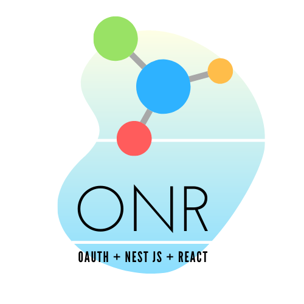

# OAuth using Nest JS and React



This is a simple POC which shows how to integrate social logins (for eg: Google) with Nest JS and React (Typescript)

## Important Links

- [Nest Authentication using OAuth 2.0](https://github.com/workfel/nest-auth)
- [Medium article - Nest JS using OAuth 2.0](https://medium.com/digikare/google-sign-in-authentication-with-nestjs-a6a4bb7de51)
- [Heroku Link](https://oauth-nest.herokuapp.com/)

## Environment Variables

- The following `environment` variables need to be set (Heroku / AWS)
- Refer the YAML file in `config > default.yml`

```javascript
  const secret = process.env.secret ? process.env.secret : config.get('jwt').secret;
  const PORT = process.env.port ? process.env.port : config.get('server').port;
```

## Google Developer Setting Instructions

